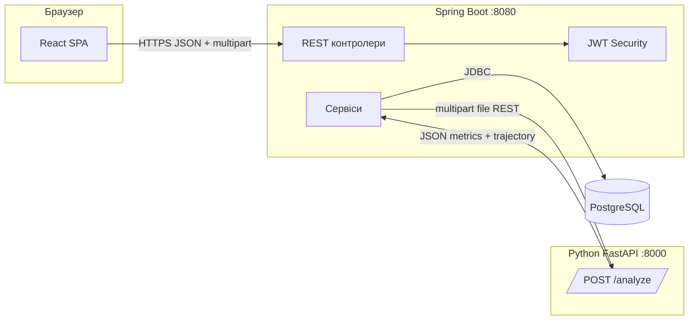

# Sky Metrics

Веб-платформа для завантаження телеметричних логів польоту (ArduPilot Dataflash `.BIN`), їх аналізу на сервісі Python та збереження результатів у PostgreSQL через Spring Boot API. Фронтенд на React (Vite) показує дашборд з метриками, 3D траєкторією (ENU), графіками та PDF-експортом; є адмін-панель для користувачів і всіх польотів.

---

## Зміст

- [Архітектура](#архітектура)
- [Структура репозиторію](#структура-репозиторію)
- [Потік даних при аналізі файлу](#потік-даних-при-аналізі-файлу)
- [Модель даних](#модель-даних)
- [API (огляд)](#api-огляд)
- [Покрокова інструкція з запуску](#покрокова-інструкція-запуску)
- [Тестові облікові записи](#тестові-облікові-записи)
- [Усунення типових проблем](#усунення-типових-проблем)

---

## Архітектура

Система складається з чотирьох логічних шарів:

| Компонент | Технології | Роль |
|-----------|------------|------|
| **Frontend** | React 19, Vite, Plotly.js (CDN), Recharts | UI: логін, завантаження, дашборд, акаунт, адмінка |
| **Backend (API)** | Spring Boot 3.2, Spring Security + JWT, JPA, PostgreSQL | Автентифікація, CRUD польотів/користувачів, оркестрація виклику Python |
| **Аналітичний сервіс** | Python 3.12, FastAPI, pandas, numpy, pymavlink | Парсинг `.BIN`, розрахунок метрик і траєкторії, JSON-відповідь |
| **База даних** | PostgreSQL 15 | Користувачі, ролі, сесії польотів, метрики, JSON траєкторії/мета |

### Діаграма взаємодії



Інтеграція з Python задається властивістю `python.service.url` (див. розділ про змінні середовища). У Docker мережі за замовчуванням використовується ім’я сервісу `flightlog` і шлях `/analyze`.

---

## Структура репозиторію

```
sky-metrics/
├── docker-compose.yml          # Повний стек: db, backend, flightlog, frontend (dev)
├── README.md                   # Цей файл
├── core/skyMetrics/            # Spring Boot моноліт (Maven)
│   ├── Dockerfile
│   ├── pom.xml
│   └── src/main/java/org/ccpc/skymetrics/
│       ├── controller/        # REST: Auth, Flight, User, LLM
│       ├── service/           # Бізнес-логіка, виклик Python, файли
│       ├── entity/            # JPA сутності
│       ├── repository/        # Spring Data JPA
│       ├── dto/               # DTO для API та маппінгу відповіді Python
│       ├── mapper/            # Mapstruct (Flight, User)
│       ├── security/          # JWT, WebSecurityConfig
│       └── config/            # Seeder, RestTemplate тощо
├── frontend/                  # React + Vite
│   ├── Dockerfile             # dev (Vite) / prod (nginx)
│   ├── package.json
│   └── src/
│       ├── App.jsx            # Маршрути, protect admin
│       ├── pages/             # Login, Upload, Dashboard, Account, Admin
│       ├── components/        # Flight3D, PlaybackSlider, панелі дашборду
│       └── utils/             # api.js, adminApi.js, authHeaders, mathUtils
└── python/                    # FastAPI сервіс аналізу
    ├── Dockerfile
    ├── requirements.txt
    └── flightlog/
        ├── server.py          # FastAPI: /health, /analyze, /call_llm
        ├── analysis.py        # Побудова JSON місії з Dataflash
        ├── dataflash.py       # Зчитування BIN
        ├── llm.py             # Опційні виклики LLM (Gemini)
        └── config.py
```

---

## Потік даних при аналізі файлу

1. Користувач у браузері авторизується (`POST /api/auth/login`), JWT зберігається на клієнті.
2. Клієнт відправляє файл на **`POST /api/flights/upload`** (multipart, поле `file`).
3. Backend:
   - Створює запис **`FlightSession`** зі статусом `PROCESSING`.
   - Пересилає той самий файл у Python **`POST {python.service.url}`** (зазвичай `http://flightlog:8000/analyze` у Docker або `http://localhost:8000/analyze` локально).
4. Python повертає JSON, сумісний з очікуваною структурою (`PythonAnalysisResponse`: `status`, `data.metrics`, `data.trajectory`, опційно `mission_analysis`, `meta`, `methodology`).
5. Backend мапить відповідь у сутності **`FlightMetrics`** та **`TrajectoryData`**, зберігає `meta`/`methodology` у JSONB, виставляє статус **`COMPLETED`** (або **`FAILED`** при помилці).
6. У відповіді клієнт отримує **`FlightDetailResponse`** з метриками та траєкторією для дашборду.

Фронтенд у `utils/api.js` нормалізує імена полів траєкторії (наприклад `time_s` → `time`, `x_east_m` → `x_east`) для компонентів 3D і графіків.

---

## Модель даних

### PostgreSQL (JPA сутності)

- **`User`** — обліковий запис; зв’язок many-to-many з **`Role`** (`ROLE_USER`, `ROLE_ADMIN`).
- **`FlightSession`** — одна сесія завантаження/аналізу:
  - `id` (UUID), `originalFilename`, `uploadedAt`, **`FlightStatus`** (`PROCESSING`, `COMPLETED`, `FAILED` тощо),
  - `aiSummary` (текст, зокрема аномалії з аналізу),
  - зв’язок з **`User`**,
  - **`FlightMetrics`** (1:1),
  - **`TrajectoryData`** як **`jsonb`** (`trajectory_jsonb`),
  - `meta_jsonb`, `methodology_jsonb` — довільний JSON з Python.

- **`FlightMetrics`** (таблиця `flight_metrics`) — агреговані числові показники:
  - тривалість, дистанція, макс. висота, приріст висоти,
  - макс. горизонтальна/вертикальна швидкість, макс. прискорення,
  - додаткові поля з IMU (на кшталт `max_speed_from_imu_trapz_m_s`), якщо є в відповіді Python.

- **`TrajectoryData`** (в БД як JSON) — масиви однакової довжини:
  - `time`, `x_east`, `y_north`, `z_up` (ENU відносно референсу),
  - `lat_deg`, `lon_deg`, `alt_m`,
  - `speed_horizontal_m_s`,
  - `reference`: `lat0_deg`, `lon0_deg`, `alt0_m`, `frame`.

Детальна форма DTO для відповіді клієнту та прийому з Python описана в **`FlightDtos.java`** (`MetricsDto`, `TrajectoryDto`, `PythonAnalysisResponse`).

### Відповідь Python (`analysis.build_mission_json`)

Ключові секції:

- **`metrics`** — ті самі логічні поля, що й у `MetricsDto` (імена у snake_case / з суфіксами `_m`, `_m_s`, `_sec` тощо залежно від серіалізації).
- **`trajectory`** — час у секундах, геодезія, ENU в метрах, опційно горизонтальна швидкість по точках.
- **`meta`** — службова інформація (лічильники повідомлень, фрагменти журналу тощо).
- **`mission_analysis`** — статус місії та список аномалій (зберігаються текстом у `aiSummary` на бекенді).
- **`methodology`** — опис методики обчислень для відображення/звітів.

Швидкість на 3D-кольоровій шкалі на фронті рахується з координат і часу у `computeSpeeds` (`mathUtils`), якщо потрібні узгоджені графіки.

---

## API (огляд)

Базовий URL для фронту задається **`VITE_API_BASE`** (за замовчуванням `http://localhost:8080` — див. `frontend/src/utils/constants.js`).

| Метод | Шлях | Призначення |
|--------|------|-------------|
| POST | `/api/auth/login` | Логін, видача JWT |
| POST | `/api/flights/upload` | Завантаження `.BIN`, аналіз через Python, збереження (потрібен JWT) |
| GET | `/api/flights` | Список польотів поточного користувача |
| GET | `/api/flights/{id}` | Деталі польоту (власник) |
| DELETE | `/api/flights/{id}` | Видалення (власник або адмін) |
| GET | `/api/users/me` | Профіль і ролі |
| GET | `/api/users/admin/all` | Адмін: усі користувачі |
| POST | `/api/users/admin/create` | Адмін: створення користувача |
| PUT | `/api/users/admin/{id}` | Адмін: оновлення профілю |
| PUT | `/api/users/admin/{id}/roles` | Адмін: ролі |
| DELETE | `/api/users/admin/{id}` | Адмін: видалення |
| GET | `/api/users/admin/stats` | Адмін: статистика |
| GET | `/api/flights/admin/all` | Адмін: усі польоти (опційно `?status=`) |
| GET | `/api/flights/admin/{id}` | Адмін: деталі польоту |

Python (окремий сервіс):

| Метод | Шлях | Призначення |
|--------|------|-------------|
| GET | `/health` | Перевірка життєздатності |
| POST | `/analyze` | Прийом файлу, повернення JSON аналізу |

CORS на бекенді дозволяє походження `http://localhost:5173` та `http://localhost:3000` (див. `WebSecurityConfig`).

---

## Покрокова інструкція запуску

### Вимоги

- **Docker Desktop** (або Docker Engine + Compose), **або** локально: **JDK 17**, **Maven**, **Node.js 18+**, **Python 3.12**, **PostgreSQL 15+**.
- Порти за замовчуванням: **5173** (frontend dev), **8080** (Java), **8000** (Python), **5440** (PostgreSQL на хості при повному `docker-compose` з кореня).

---

### Варіант A: увесь стек через Docker Compose (рекомендовано для перевірки)

1. Клонуйте репозиторій і перейдіть у корінь проєкту:

   ```bash
   cd sky-metrics
   ```

2. Переконайтеся, що **Docker** доступний у терміналі (`docker version`, `docker compose version`).

3. Запустіть усі сервіси:

   ```bash
   docker compose up --build
   ```

4. Дочекайтеся готовності:
   - контейнер **db** — healthy;
   - **backend** слухає **8080**;
   - **flightlog** — **8000**;
   - **frontend** — **5173**.

5. Відкрийте в браузері: **`http://localhost:5173`**.

6. Увійдіть під тестовим адміном (див. [Тестові облікові записи](#тестові-облікові-записи)) або створіть користувача через адмінку.

7. Завантажте файл `.BIN` на головному екрані — після успішного аналізу відкриється дашборд з 3D і метриками.

**Зупинка:**

```bash
docker compose down
```

**Важливо:** у кореневому `docker-compose.yml` порт контейнера БД **5432** проброшено на хост як **`localhost:5440`**. Якщо Spring запускається **локально**, а БД — лише в Docker, використовуйте `jdbc:postgresql://localhost:5440/skymetrics_db` (користувач `postgres`, пароль `root`). Якщо PostgreSQL піднято локально на стандартному порту, залиште `localhost:5432`, як у `application.properties`.

---

### Варіант B: локальний запуск без Docker (розробка)

#### B1. База даних

1. Створіть БД `skymetrics_db`, користувач/пароль як у `core/skyMetrics/src/main/resources/application.properties` (`postgres` / `root`) або задайте свої через змінні середовища Spring.

2. Запустіть PostgreSQL на порту **5432** (або змініть URL у налаштуваннях).

#### B2. Python (аналітика)

1. Перейдіть у каталог `python`:

   ```bash
   cd python
   ```

2. Створіть віртуальне середовище та встановіть залежності:

   ```bash
   python -m venv .venv
   .venv\Scripts\activate
   pip install -r requirements.txt
   ```

3. Запустіть API:

   ```bash
   uvicorn flightlog.server:app --host 0.0.0.0 --port 8000
   ```

4. Переконайтеся: **`http://localhost:8000/health`** повертає `{"status":"ok"}`.

#### B3. Spring Boot

1. Перейдіть у `core/skyMetrics`.

2. Задайте URL Python для **локально** запущеного сервісу, наприклад:

   ```bash
   set PYTHON_SERVICE_URL=http://localhost:8000/analyze
   ```

   (Linux/macOS: `export PYTHON_SERVICE_URL=http://localhost:8000/analyze`)

   Або змініть `python.service.url` у `application.properties`.

3. Запустіть додаток:

   ```bash
   mvn spring-boot:run
   ```

4. Перевірка: **`http://localhost:8080`** (на відсутність помилок у консолі; конкретні actuator-ендпоінти залежать від конфігурації).

#### B4. Frontend

1. Перейдіть у `frontend`:

   ```bash
   cd frontend
   npm install
   ```

2. За потреби створіть `.env`:

   ```env
   VITE_API_BASE=http://localhost:8080
   ```

3. Запуск dev-сервера:

   ```bash
   npm run dev
   ```

4. Відкрийте **`http://localhost:5173`**.

---

### Змінні середовища (коротко)

| Змінна | Де використовується | Приклад |
|--------|----------------------|---------|
| `VITE_API_BASE` | Збірка/рантайм Vite — база URL Java API | `http://localhost:8080` |
| `SPRING_DATASOURCE_URL` | Spring — JDBC URL | `jdbc:postgresql://localhost:5432/skymetrics_db` |
| `SPRING_DATASOURCE_USERNAME` / `PASSWORD` | Spring — БД | `postgres` / `root` |
| `python.service.url` або `PYTHON_SERVICE_URL` | Spring — виклик FastAPI | `http://localhost:8000/analyze` |

У Docker Compose для бекенда зазвичай достатньо змінних `SPRING_DATASOURCE_*`; URL Python уже прописаний у `application.properties` для хоста `flightlog`.

---

## Тестові облікові записи

Після старту застосунку **`DatabaseSeeder`** створює користувачів (якщо їх ще немає):

- **Адміністратор:** логін `admin`, email `admin@skymetrics.com`, пароль **`admin123`** (ролі `ROLE_ADMIN` та `ROLE_USER`).
- **Тестові користувачі:** `user1` … `user5`, email `user{i}@gmail.com`, пароль **`admin123`**, роль `ROLE_USER`.

---

## Усунення типових проблем

1. **`docker` не знайдено в PowerShell** — встановіть Docker Desktop і перезапустіть термінал; переконайтеся, що `docker` у `PATH`.

2. **Java не знаходить Python** — перевірте `python.service.url`: з хоста має бути `http://localhost:8000/analyze`, з Docker-мережі — `http://flightlog:8000/analyze`.

3. **CORS / 401 на фронті** — фронт має ходити на дозволений origin (`5173`); для API потрібен заголовок `Authorization: Bearer <JWT>` після логіну (робить `authHeaders.js`).

4. **Файли на диску** — `FileStorageService` використовує каталог `uploads` відносно робочої директорії JVM; при видаленні польоту виконується спроба видалити файл за шаблоном `{sessionId}_{originalFilename}`.

---

## Ліцензія та авторство

Уточніть у власників репозиторію умови використання та розповсюдження коду.
